# EU Solicit — User Journeys, UX Workflows & E2E Dataflows

**Platform**: EU Solicit | **Domain**: EUSolicit.com | **Version**: 1.0 | **Date**: 2026-04-04 | **Status**: Draft

**Companion documents**: Requirements Brief v4, Solution Architecture v3.1, Service Decomposition v1.1

---

## 1. User Personas

### 1.1 Persona: Free Explorer

| Attribute | Detail |
|---|---|
| **Name** | Maria — Junior Business Development Associate |
| **Company** | Small IT consultancy (8 employees), Sofia, Bulgaria |
| **Goal** | Evaluate whether EU Solicit is worth paying for by browsing available tenders |
| **Tier** | Free |
| **Key frustration** | Spends 3–4 hours weekly scanning AOP and TED manually; misses deadlines |
| **Success metric** | Finds a relevant opportunity within first session, understands what she'd get by upgrading |

### 1.2 Persona: Starter User

| Attribute | Detail |
|---|---|
| **Name** | Georgi — Owner-operator of a construction firm |
| **Company** | Regional construction firm (25 employees), Plovdiv, Bulgaria |
| **Goal** | Monitor Bulgarian public works tenders under €500K, get AI summaries to decide which to bid on |
| **Tier** | Starter (€29/mo) |
| **Key frustration** | Can't afford a bid consultant for every tender; often bids blind |
| **Success metric** | Uses AI summaries to pre-qualify 3–5 tenders/month; spends less time reading docs |

### 1.3 Persona: Professional User

| Attribute | Detail |
|---|---|
| **Name** | Elena — Bid Manager at a mid-size engineering firm |
| **Company** | Infrastructure engineering firm (120 employees), Sofia + Bucharest offices |
| **Goal** | Full proposal lifecycle — discovery through AI-drafted proposals and compliance checks across BG + RO + GR |
| **Tier** | Professional (€59/mo) |
| **Key frustration** | Preparing a competitive proposal takes 2–3 weeks and €5K–€15K in consultant fees |
| **Success metric** | Cuts proposal prep time by 50%; increases win rate from 15% to 25% |

### 1.4 Persona: Enterprise User

| Attribute | Detail |
|---|---|
| **Name** | Nikolai — Director of EU Programmes at a consulting firm |
| **Company** | Public sector consulting firm (50 consultants), managing 30+ client bids/year across all EU |
| **Goal** | White-label the platform for his clients; run unlimited proposals; API access for internal tools |
| **Tier** | Enterprise (€109+/mo) |
| **Key frustration** | Coordination across 10+ concurrent bids; no institutional memory between projects |
| **Success metric** | Manages all client bids from one dashboard; lessons from past bids auto-feed new proposals |

### 1.5 Persona: Platform Administrator

| Attribute | Detail |
|---|---|
| **Name** | Dimitar — Product Owner / Platform Admin |
| **Company** | EU Solicit (operator) |
| **Goal** | Configure compliance frameworks, monitor crawler health, oversee tenant subscriptions, manage white-label configs |
| **Tier** | Admin (no tier — full access) |
| **Key frustration** | Regulatory changes can invalidate compliance checks; must react quickly |
| **Success metric** | All active opportunities have correct compliance frameworks; crawlers run reliably on schedule |

---

## 2. User Journey Maps

### Journey 1: Free Discovery → Upgrade Conversion

**Persona**: Maria (Free Explorer)

```
Phase         │ Discover          │ Explore           │ Hit Paywall        │ Convert
──────────────┼───────────────────┼───────────────────┼────────────────────┼──────────────────
Action        │ Google "Bulgarian │ Browse opportunity │ Click on a tender  │ Click "Upgrade"
              │ tender monitoring"│ catalogue, filter  │ to see full docs   │ on upgrade prompt
              │ → lands on        │ by region, CPV     │ + AI summary       │ → Stripe Checkout
              │ eusolicit.com     │ sector, deadline   │                    │ → 14-day trial
──────────────┼───────────────────┼───────────────────┼────────────────────┼──────────────────
Touchpoint    │ Landing page      │ Opportunity list   │ Opportunity detail │ Stripe Checkout
              │ SEO / SSR         │ (limited metadata) │ (gated content)    │ Trial activation
──────────────┼───────────────────┼───────────────────┼────────────────────┼──────────────────
Emotion       │ Curious           │ Impressed by       │ Frustrated: can    │ Relieved: trial
              │                   │ coverage breadth   │ see the name but   │ is free, no card
              │                   │                    │ not the details    │ required
──────────────┼───────────────────┼───────────────────┼────────────────────┼──────────────────
System        │ Next.js SSR page  │ Client API: tier-  │ Client API: 403   │ Client API →
              │ served via CDN    │ gated search       │ with upgrade_url   │ Stripe → webhook
              │                   │ returns Free       │ returns limited    │ → subscription
              │                   │ metadata only      │ response + CTA     │ created event
──────────────┼───────────────────┼───────────────────┼────────────────────┼──────────────────
UX Req        │ UX-F01: Public    │ UX-F02: Clearly   │ UX-F03: Gated     │ UX-F04: Seamless
              │ landing with SEO  │ show what's hidden │ content must show  │ trial activation
              │ metadata for      │ behind paywall     │ a compelling       │ with zero-
              │ crawl tenders     │ (blur/lock icons)  │ upgrade prompt     │ friction
              │                   │ on restricted data │ with tier benefits │ onboarding wizard
```

**UX Requirements surfaced**:

- **UX-F01**: Public landing pages must be SSR for SEO. Tender titles and metadata visible to search engines.
- **UX-F02**: Free-tier opportunity list must visually indicate locked content (blur, lock icons, "Upgrade to view" badges) — not simply hide it. The user must feel the value they're missing.
- **UX-F03**: Gated content screen must show a contextual upgrade prompt: "This tender has 42 pages of requirements. Upgrade to Starter to read the AI summary." Include tier comparison inline.
- **UX-F04**: Trial activation completes in ≤3 clicks: "Start Free Trial" → email confirmation → redirect to full opportunity detail. No credit card required for 14-day Professional trial.
- **UX-F05** (supplementary): First-time login wizard collects company profile, CPV sector preferences, and region interests to pre-configure alert preferences and tier-gated filters.

---

### Journey 2: Starter — Opportunity Monitoring & AI Summaries

**Persona**: Georgi (Starter User)

```
Phase         │ Configure         │ Monitor            │ Triage             │ Decide
──────────────┼───────────────────┼────────────────────┼────────────────────┼──────────────────
Action        │ Set alert prefs:  │ Receive daily      │ Open opportunity   │ Read AI summary
              │ CPV 45 (constr.), │ email digest with  │ detail from email  │ → decide bid or
              │ Bulgaria, ≤500K   │ matching tenders   │ link               │ skip
──────────────┼───────────────────┼────────────────────┼────────────────────┼──────────────────
Touchpoint    │ Alert prefs UI    │ Email inbox        │ Opportunity detail │ AI Summary panel
              │ + iCal subscribe  │ (SendGrid)         │ page               │ (usage counter
              │                   │                    │                    │ shown: 3/10 used)
──────────────┼───────────────────┼────────────────────┼────────────────────┼──────────────────
Emotion       │ Empowered:        │ Satisfied: no      │ Focused: full docs │ Confident: can
              │ exactly my niche  │ more manual        │ available inline   │ decide in 5 min
              │                   │ portal scanning    │                    │ instead of 2 hrs
──────────────┼───────────────────┼────────────────────┼────────────────────┼──────────────────
System        │ Client API saves  │ Notification Svc   │ Client API returns │ Client API →
              │ prefs → publishes │ matches opps →     │ full opp data      │ AI Gateway →
              │ alert_preference  │ generates digest   │ (region/CPV/       │ KraftData
              │ .updated event    │ via SendGrid       │ budget checked)    │ Executive Summary
              │                   │                    │                    │ Agent → usage
              │                   │                    │                    │ meter incremented
──────────────┼───────────────────┼────────────────────┼────────────────────┼──────────────────
UX Req        │ UX-S01: CPV       │ UX-S02: Email      │ UX-S03: Tier      │ UX-S04: AI
              │ sector picker     │ digest must be     │ boundary is        │ summary panel
              │ with search +     │ mobile-responsive  │ invisible to       │ with usage counter
              │ autocomplete      │ with deep links    │ authorized users   │ and "upgrade for
              │                   │ to opp detail      │                    │ more" prompt at
              │                   │                    │                    │ limit
```

**UX Requirements surfaced**:

- **UX-S01**: CPV sector picker must support hierarchical search (e.g., type "45" → "Construction work" with sub-categories). Region picker shows Bulgaria's districts for Starter, EU countries for Pro/Enterprise.
- **UX-S02**: Email digest must be mobile-responsive HTML with deep links directly into the opportunity detail page (authenticated via magic link or session).
- **UX-S03**: When a Starter user accesses an opportunity within their tier limits, the experience should feel unlimited — no "you're on Starter" friction. Tier enforcement is invisible when within bounds.
- **UX-S04**: AI summary panel shows remaining usage count ("3 of 10 summaries used this month"). At limit, button switches to "Upgrade to Professional for 50/month".
- **UX-S05** (supplementary): iCal subscription URL displayed prominently on alerts settings page with copy-to-clipboard and QR code for mobile calendar apps.

---

### Journey 3: Professional — Full Proposal Lifecycle

**Persona**: Elena (Professional User)

```
Phase         │ Discover          │ Analyze           │ Bid Decision       │ Propose
──────────────┼───────────────────┼───────────────────┼────────────────────┼──────────────────
Action        │ Alert email →     │ Upload full tender│ Run Bid/No-Bid    │ Generate AI
              │ review matched    │ package → AI      │ decision agent →  │ proposal draft →
              │ opportunities     │ parses + extracts │ review scorecard  │ stream in real-
              │                   │ requirements      │ → approve bid     │ time via SSE
──────────────┼───────────────────┼───────────────────┼────────────────────┼──────────────────
Touchpoint    │ Email + Dashboard │ Document upload   │ Bid/No-Bid        │ Proposal editor
              │                   │ + analysis panel  │ scorecard modal   │ (Tiptap)
──────────────┼───────────────────┼───────────────────┼────────────────────┼──────────────────
Emotion       │ Excited: 3 new    │ Impressed: 200-   │ Confident: data-  │ Amazed: first
              │ tenders match     │ page doc parsed   │ driven decision   │ draft in 3 min
              │                   │ in 30 seconds     │ not gut feeling   │ not 3 weeks
──────────────┼───────────────────┼───────────────────┼────────────────────┼──────────────────
System        │ Notification Svc  │ Client API →      │ Client API →      │ Client API →
              │ → email           │ S3 + ClamAV →     │ AI Gateway →      │ AI Gateway SSE
              │                   │ AI Gateway →      │ KraftData         │ → KraftData
              │                   │ KraftData Doc     │ Bid/No-Bid Agent  │ Proposal Workflow
              │                   │ Parser Agent      │ → result stored   │ → streamed to UI
```

```
Phase         │ Validate          │ Optimize          │ Export & Submit
──────────────┼───────────────────┼───────────────────┼──────────────────
Action        │ Run compliance    │ Run scoring       │ Export PDF/DOCX →
              │ checker against   │ simulator →       │ follow portal
              │ assigned          │ review per-       │ submission
              │ framework         │ criterion scores  │ instructions
              │                   │ → iterate         │
──────────────┼───────────────────┼───────────────────┼──────────────────
Touchpoint    │ Compliance        │ Scorecard view    │ Export dialog +
              │ report panel      │ with improvement  │ submission
              │                   │ suggestions       │ guide panel
──────────────┼───────────────────┼───────────────────┼──────────────────
Emotion       │ Reassured: no     │ Strategic: knows  │ Prepared: fully
              │ missing items     │ exactly where to  │ guided, just
              │                   │ improve           │ submit externally
──────────────┼───────────────────┼───────────────────┼──────────────────
System        │ Client API →      │ Client API →      │ Client API →
              │ AI Gateway →      │ AI Gateway →      │ doc export
              │ KraftData         │ KraftData Scoring │ (python-docx /
              │ Compliance        │ Simulator Agent   │ reportlab) →
              │ Checker Agent     │                   │ S3 download
──────────────┼───────────────────┼───────────────────┼──────────────────
UX Req        │ UX-P01            │ UX-P02            │ UX-P03
```

**UX Requirements surfaced**:

- **UX-P01**: Compliance report must show pass/fail per checklist item with direct links to the proposal section that needs fixing. Red/amber/green status badges.
- **UX-P02**: Scoring simulator scorecard must show per-criterion predicted score vs. maximum, with inline AI suggestions. Allow "re-score" after edits to see improvement.
- **UX-P03**: Export dialog must let user choose format (PDF/DOCX), include/exclude sections, and display a "Submission Guide" panel with portal-specific instructions (URL, form name, deadline countdown).
- **UX-P04** (supplementary): Proposal editor must support real-time SSE streaming — text appears progressively as the AI generates it, with a "Stop generation" button.
- **UX-P05** (supplementary): Bid/No-Bid scorecard must show: strategic fit score, win probability estimate, resource availability check, margin analysis, and an overall recommendation (Bid / No-Bid / Conditional). User override requires a text justification that is logged in the audit trail.
- **UX-P06** (supplementary): Document upload must show virus scan progress, file size validation (100MB limit), and supported format indicators. Multi-file upload with drag-and-drop.
- **UX-P07** (supplementary): Calendar events for tracked opportunities must appear in the sidebar — deadline, clarification period, site visit dates. Google/Outlook sync status indicator.
- **UX-P08** (supplementary): Version history panel on proposals showing diff between versions, with author attribution and timestamp.

---

### Journey 4: Enterprise — Multi-Client White-Label Operations

**Persona**: Nikolai (Enterprise User)

```
Phase         │ Configure         │ Onboard Client    │ Operate            │ Analyze
──────────────┼───────────────────┼───────────────────┼────────────────────┼──────────────────
Action        │ Set up white-     │ Create team       │ Run concurrent     │ Review cross-
              │ label subdomain   │ members for       │ proposals for      │ client analytics
              │ + branding +      │ client project,   │ multiple clients   │ + lessons learned
              │ API key           │ assign roles      │ across EU          │ + competitor view
──────────────┼───────────────────┼───────────────────┼────────────────────┼──────────────────
Touchpoint    │ Admin settings    │ Team management   │ Proposal dashboard │ Analytics hub
              │ + API docs        │ panel             │ (multi-tender)     │ + pipeline
              │                   │                   │                    │ forecasting
──────────────┼───────────────────┼───────────────────┼────────────────────┼──────────────────
Emotion       │ Professional:     │ Efficient: quick  │ In control:        │ Strategic:
              │ clients see       │ client setup      │ parallel bid mgmt  │ data-driven
              │ branded portal    │                   │ across projects    │ portfolio mgmt
──────────────┼───────────────────┼───────────────────┼────────────────────┼──────────────────
System        │ Client API:       │ Client API: RBAC  │ All services at    │ Client API reads
              │ whitelabel_config │ + company + team   │ full capacity,     │ analytics views,
              │ stored in DB,     │ member CRUD       │ unlimited usage    │ AI Gateway runs
              │ subdomain DNS     │                   │ (no metering       │ Market Intel +
              │ via Cloudflare    │                   │ limits)            │ Competitor agents
──────────────┼───────────────────┼───────────────────┼────────────────────┼──────────────────
UX Req        │ UX-E01            │ UX-E02            │ UX-E03             │ UX-E04
```

**UX Requirements surfaced**:

- **UX-E01**: White-label setup wizard: subdomain, logo upload, primary/accent colors, email sender domain. Preview mode before activation.
- **UX-E02**: Team management with role assignment (bid manager, technical writer, financial analyst, legal reviewer, read-only). Bulk invite via CSV or email list.
- **UX-E03**: Multi-tender dashboard showing all active bids with status (draft, in review, submitted, won, lost), deadlines as a Gantt-style timeline, and assignment by team member.
- **UX-E04**: Cross-client analytics with filterable views: win rate by sector, average score by CPV, revenue pipeline forecast, competitor overlap analysis. Exportable as PDF/DOCX reports.
- **UX-E05** (supplementary): API documentation page (auto-generated OpenAPI spec) accessible from the Enterprise settings panel. Includes API key management (create, rotate, revoke) with usage analytics.
- **UX-E06** (supplementary): Lessons Learned feed — when a bid outcome is recorded, the platform prompts the user to run the Lessons Learned Agent. Insights are stored and automatically referenced by the Proposal Generator Workflow for future bids.

---

### Journey 5: Platform Admin — Compliance & Operations

**Persona**: Dimitar (Platform Administrator)

```
Phase         │ Configure         │ Monitor           │ Intervene          │ Analyze
──────────────┼───────────────────┼───────────────────┼────────────────────┼──────────────────
Action        │ Assign compliance │ Check crawler     │ Regulation change  │ Review platform
              │ frameworks to new │ health dashboards │ detected → update  │ analytics: signup
              │ ingested opps     │ + agent quality   │ framework → re-    │ funnel, churn,
              │ (auto-suggested)  │ eval scores       │ validate affected  │ agent quality
              │                   │                   │ opportunities      │
──────────────┼───────────────────┼───────────────────┼────────────────────┼──────────────────
Touchpoint    │ Admin: Compliance │ Admin: Operations │ Admin: Compliance  │ Admin: Platform
              │ assignment queue  │ dashboard         │ framework editor   │ analytics
──────────────┼───────────────────┼───────────────────┼────────────────────┼──────────────────
Emotion       │ Efficient: auto-  │ Confident: all    │ Urgent but in     │ Informed: clear
              │ suggestion handles│ systems green     │ control — can bulk │ view of business
              │ 90% of cases      │                   │ re-validate        │ health
──────────────┼───────────────────┼───────────────────┼────────────────────┼──────────────────
System        │ Admin API: reads  │ Admin API: reads  │ Admin API: updates │ Admin API: reads
              │ pipeline opps →   │ Grafana metrics + │ compliance_frame-  │ aggregated
              │ AI Gateway runs   │ KraftData eval    │ works → publishes  │ analytics from
              │ Framework         │ scores            │ framework_assigned │ client + pipeline
              │ Suggestion Agent  │                   │ event → Client API │ schemas (read-
              │ → admin confirms  │                   │ refreshes          │ only)
──────────────┼───────────────────┼───────────────────┼────────────────────┼──────────────────
UX Req        │ UX-A01            │ UX-A02            │ UX-A03             │ UX-A04
```

**UX Requirements surfaced**:

- **UX-A01**: Compliance assignment queue: list of newly ingested opportunities without a framework. Each row shows the auto-suggested framework with a "Confirm" button and an "Override" dropdown. Bulk confirm for batches.
- **UX-A02**: Operations dashboard: crawler last-run time + status (green/amber/red), agent avg latency, eval quality scores, Redis Stream consumer lag, Celery queue depth. Alert badges for anomalies.
- **UX-A03**: Framework editor with versioning. When a framework is updated, show impacted opportunities count. "Re-validate all" button triggers batch compliance re-check via AI Gateway.
- **UX-A04**: Platform analytics: signup funnel (free → trial → paid), tier distribution, churn rate, agent usage heatmap (which agents are most/least used), revenue MRR/ARR. All filterable by date range.
- **UX-A05** (supplementary): Audit log viewer with full-text search, filterable by user, action type, entity, and date range. Export to CSV.
- **UX-A06** (supplementary): Tenant management view: all companies with subscription status, usage metrics, last login. Ability to impersonate a user for support (with audit logging).

---

## 3. End-to-End Workflows & Service-Level Dataflows

### Workflow 1: Opportunity Ingestion Pipeline

**Trigger**: Celery Beat schedule (configurable: immediate, daily, weekly per crawler)

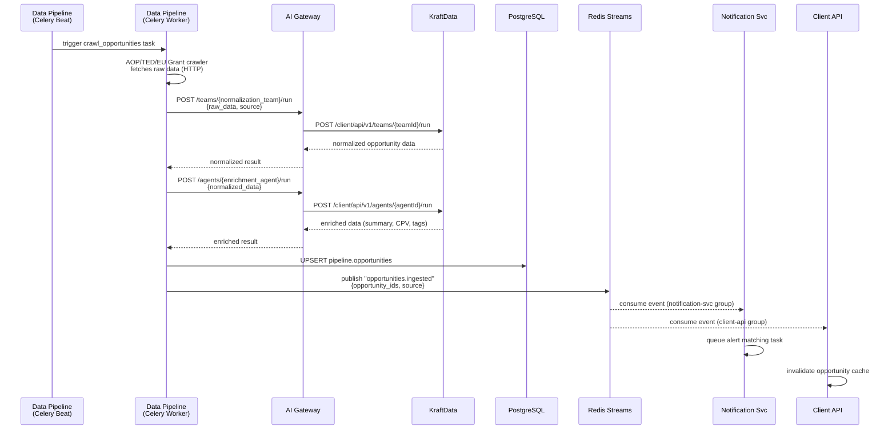

**DB writes**: `pipeline.opportunities` (upsert), `pipeline.crawler_runs` (log), `gateway.agent_executions` (log), `shared.audit_log`

**Error handling**: If KraftData is unavailable (circuit breaker open), the worker stores raw data in `pipeline.enrichment_queue` for retry. Existing opportunity data remains available in Client API.

---

### Workflow 2: Alert Digest Generation & Delivery

**Trigger**: Celery Beat schedule (per user preference: immediate on `opportunities.ingested` event, or daily/weekly batch)

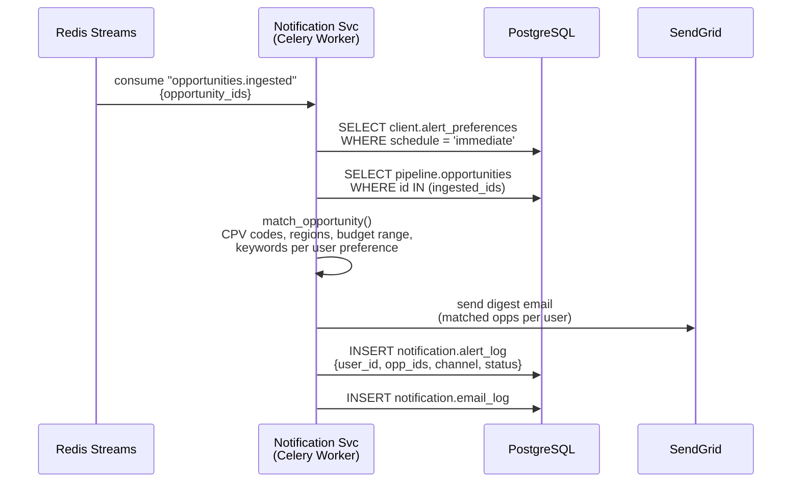

**Daily/weekly digests**: Celery Beat fires `generate_daily_digest` at 08:00 UTC and `generate_weekly_digest` on Monday 08:00 UTC. These tasks query all users with the respective schedule preference and aggregate matching opportunities since last digest.

**DB reads**: `client.alert_preferences`, `pipeline.opportunities`, `client.users` (email)
**DB writes**: `notification.alert_log`, `notification.email_log`

---

### Workflow 3: User Registration → Trial Activation

**Trigger**: User clicks "Sign Up" on eusolicit.com

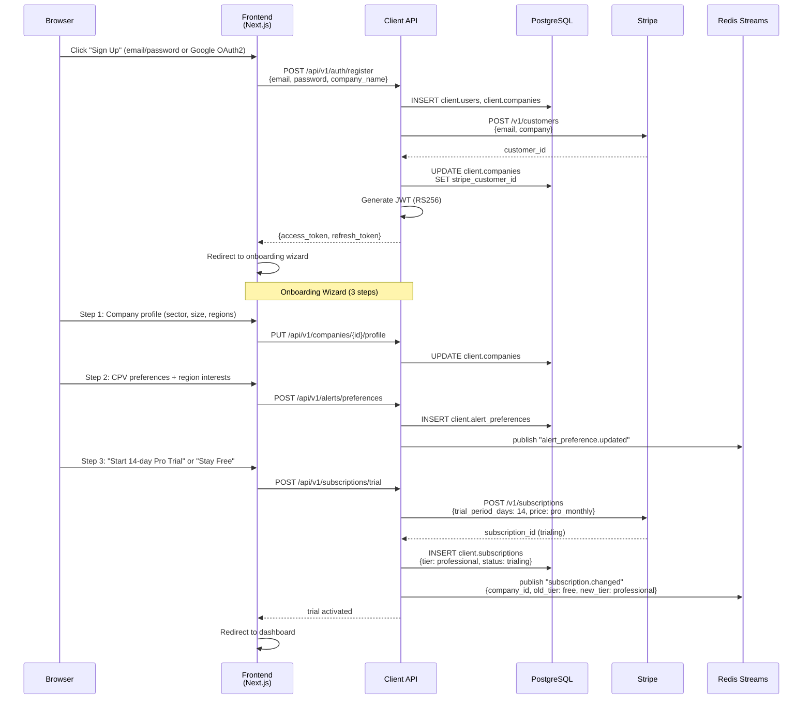

**DB writes**: `client.users`, `client.companies`, `client.alert_preferences`, `client.subscriptions`, `shared.audit_log`

---

### Workflow 4: AI Summary Generation (Tier-Gated + Usage-Metered)

**Trigger**: User clicks "Generate AI Summary" on opportunity detail page

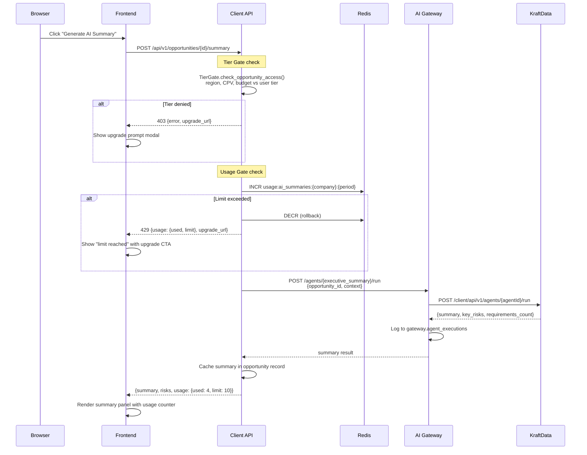

**DB reads**: `client.subscriptions`, `client.tier_access_policies`, `pipeline.opportunities`
**DB writes**: `gateway.agent_executions`, `shared.usage_meters`, `shared.audit_log`
**Redis**: Usage counter atomic INCR/DECR

---

### Workflow 5: Proposal Generation (SSE Streaming)

**Trigger**: User clicks "Generate Proposal Draft" on opportunity detail page (Professional/Enterprise)

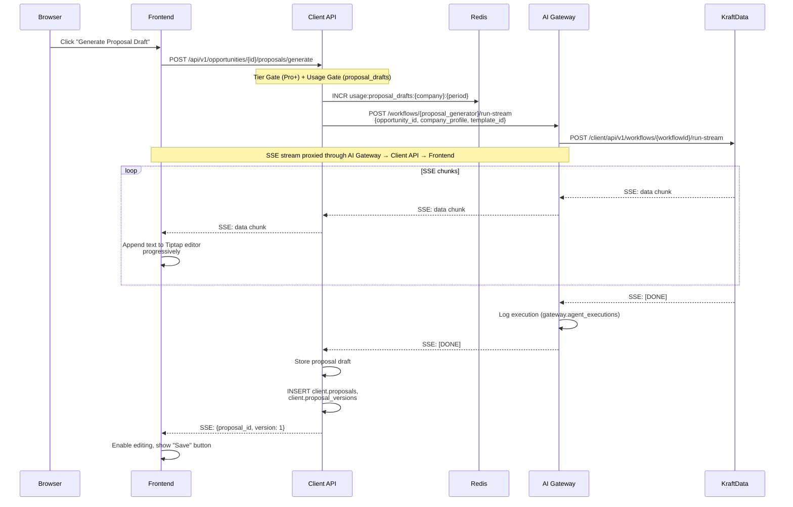

**DB writes**: `client.proposals`, `client.proposal_versions`, `gateway.agent_executions`, `shared.usage_meters`, `shared.audit_log`
**Real-time UX**: Text streams into the editor character-by-character. "Stop generation" button sends abort signal. Progress indicator shows workflow stage (e.g., "Analyzing requirements... Drafting technical approach... Building timeline...").

---

### Workflow 6: Bid/No-Bid Decision

**Trigger**: User clicks "Run Bid/No-Bid Analysis" on opportunity detail page

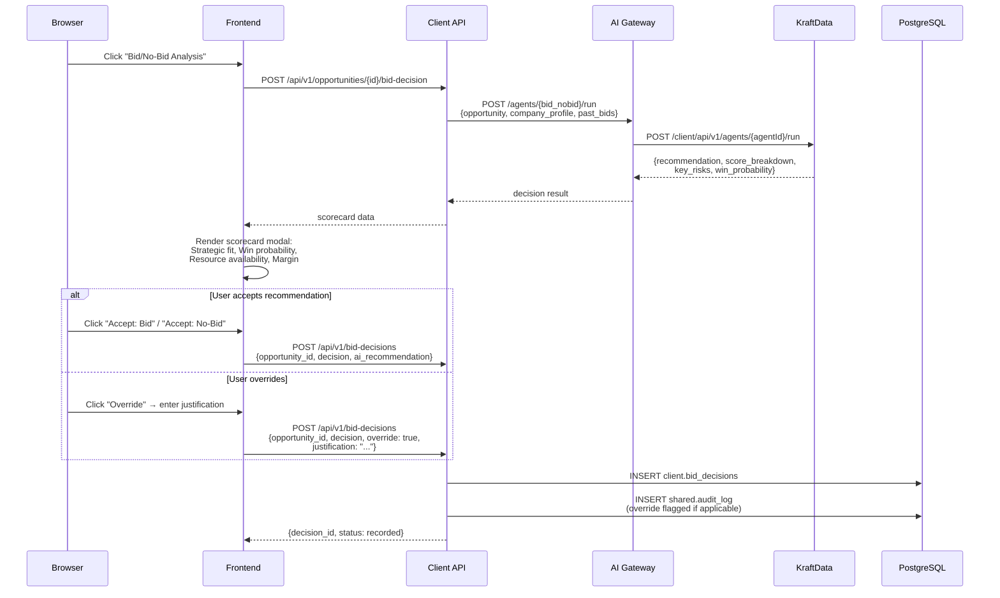

**Audit trail**: Override decisions are prominently logged with the user's justification, AI recommendation, and score breakdown. The audit log entry includes before (AI recommendation) and after (user decision) values.

---

### Workflow 7: Compliance Check Against Assigned Framework

**Trigger**: User clicks "Run Compliance Check" on a proposal

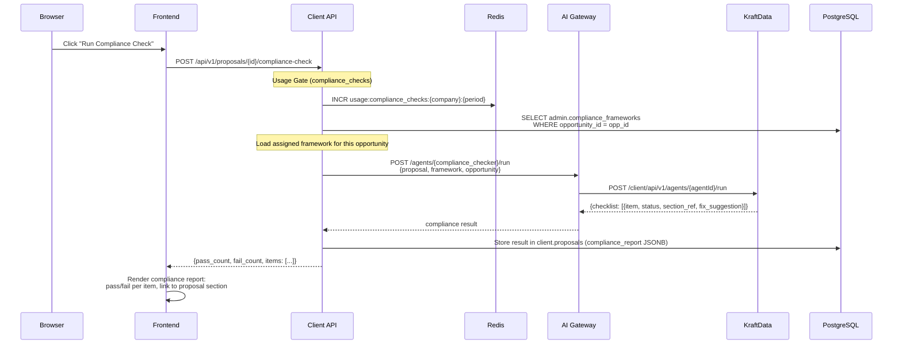

**Key detail**: The compliance check validates against the specific framework assigned to the opportunity by the admin — not a generic ruleset. If no framework is assigned, the UI shows "Awaiting compliance framework assignment" with no check available.

---

### Workflow 8: Calendar Sync (Google Calendar)

**Trigger**: User connects Google Calendar (Professional/Enterprise) + periodic Celery Beat sync

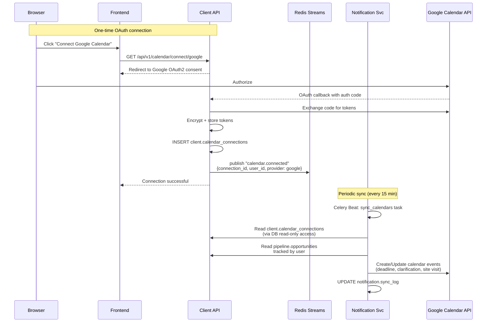

**DB reads**: `client.calendar_connections`, `client.calendar_events`, `pipeline.opportunities`
**DB writes**: `client.calendar_events`, `notification.sync_log`
**Token management**: Notification Service refreshes OAuth tokens before expiry; stores encrypted tokens in `client.calendar_connections`.

---

### Workflow 9: Stripe Subscription Lifecycle

**Trigger**: User upgrades, downgrades, or cancels subscription

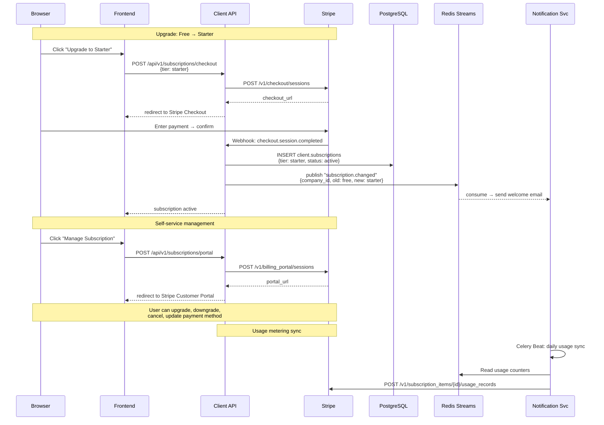

---

### Workflow 10: Admin — Compliance Framework Assignment

**Trigger**: New opportunities ingested (auto-suggestion) or manual admin action

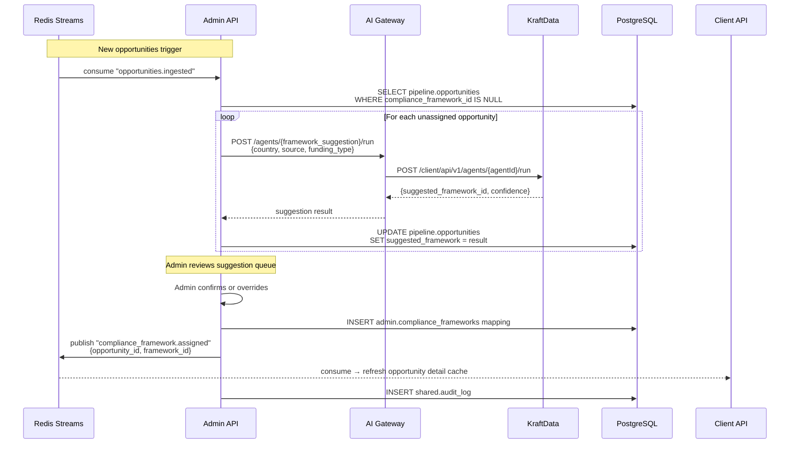

**Important**: Auto-suggestion runs automatically on ingestion, but final assignment always requires admin confirmation. This is a human-in-the-loop gate for regulatory correctness.

---

### Workflow 11: EU Grant Eligibility & Application Support

**Trigger**: User views an EU grant opportunity and clicks "Check Eligibility"

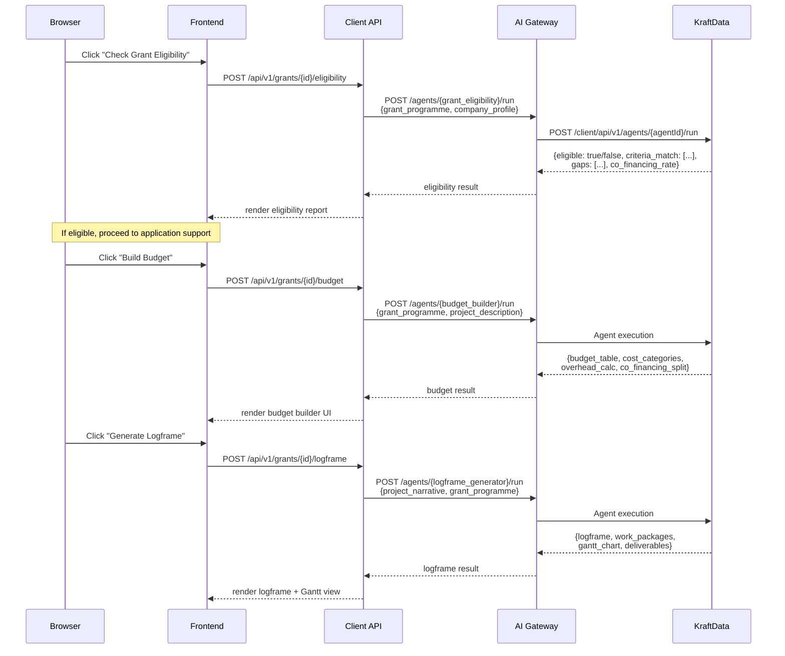

---

### Workflow 12: Bid Outcome Recording & Lessons Learned Loop

**Trigger**: User records bid outcome after award decision

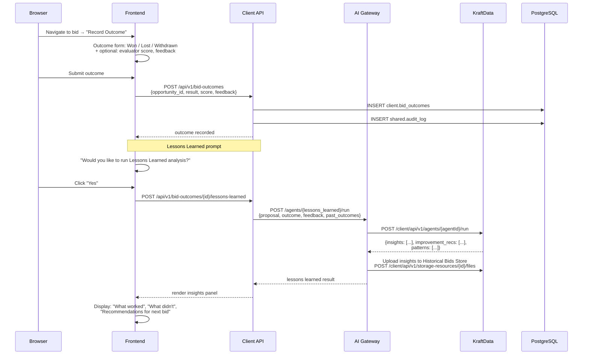

**Feedback loop**: The insights uploaded to KraftData's Historical Bids Store are automatically referenced by the Proposal Generator Workflow on future bids, closing the institutional memory loop.

---

## 4. Supplementary Business Requirements

The following requirements emerged during user journey mapping and are not explicitly covered in the Requirements Brief v4. They are recommended additions.

### 4.1 Onboarding & Activation

| ID | Requirement | Rationale | Priority |
|---|---|---|---|
| BR-S01 | First-login onboarding wizard (3 steps: company profile, CPV/region prefs, trial prompt) | Without guided setup, users won't configure alerts and won't see value quickly. High churn risk. | **Must-have** |
| BR-S02 | Deep links in email digests must authenticate via magic link or session token | Users abandon if forced to login after clicking an email link. Reduces friction to engagement. | **Must-have** |
| BR-S03 | Empty-state designs for every major view (no opportunities, no proposals, no outcomes) | Empty screens cause confusion. Guide users to the next action. | **Must-have** |

### 4.2 Upgrade & Conversion

| ID | Requirement | Rationale | Priority |
|---|---|---|---|
| BR-S04 | Contextual upgrade prompts with tier comparison at every paywall touchpoint | Generic "upgrade" buttons convert poorly. Show exactly what the user gains. | **Must-have** |
| BR-S05 | Trial expiry warning sequence: 3 days, 1 day, expired — via email + in-app banner | Users forget about trials. Timely reminders prevent churn at conversion point. | **Must-have** |
| BR-S06 | Downgrade path must clearly show what the user will lose (features, data retention) | Transparent downgrade reduces support tickets and builds trust. | **Should-have** |

### 4.3 Proposal & Workflow UX

| ID | Requirement | Rationale | Priority |
|---|---|---|---|
| BR-S07 | "Stop generation" button for SSE-streamed AI outputs | Users must be able to abort long AI generations. Essential for UX control. | **Must-have** |
| BR-S08 | Proposal version diff view (side-by-side or inline) with author attribution | Bid managers need to track what changed between iterations. | **Should-have** |
| BR-S09 | Compliance check unavailable state when no framework assigned to opportunity | Prevents confusing "no results" when the real issue is missing admin config. | **Must-have** |
| BR-S10 | Scoring simulator "re-score" after edits to show improvement | The value of the simulator is iterative improvement, not one-shot scoring. | **Should-have** |

### 4.4 Enterprise & Multi-User

| ID | Requirement | Rationale | Priority |
|---|---|---|---|
| BR-S11 | Multi-tender Gantt-style dashboard for Enterprise bid managers | Operating 10+ concurrent bids without a timeline view is unmanageable. | **Should-have** |
| BR-S12 | Bulk team invite via CSV or email list | Enterprise onboards entire consulting teams; one-by-one is impractical. | **Should-have** |
| BR-S13 | White-label preview mode before activation | Branding mistakes on live subdomains damage client trust. | **Must-have** |

### 4.5 Admin & Operations

| ID | Requirement | Rationale | Priority |
|---|---|---|---|
| BR-S14 | Compliance framework versioning with impact analysis | Regulatory changes affect live validations; admin needs to see blast radius. | **Must-have** |
| BR-S15 | Bulk framework confirmation for auto-suggested assignments | Processing 50+ new opportunities individually is impractical. | **Must-have** |
| BR-S16 | Admin user impersonation with full audit logging | Support team needs to see what the user sees without sharing credentials. | **Should-have** |

### 4.6 Data & Content

| ID | Requirement | Rationale | Priority |
|---|---|---|---|
| BR-S17 | Opportunity status lifecycle: Open → Closing Soon → Closed → Awarded | Users need to see deadline urgency at a glance. "Closing Soon" drives action. | **Must-have** |
| BR-S18 | Lessons Learned prompt after every bid outcome recording | Closing the feedback loop is the core differentiator; must be prompted, not buried. | **Must-have** |
| BR-S19 | iCal subscription URL with copy-to-clipboard and QR code | Calendar subscription is a high-value, low-effort feature — make it frictionless. | **Should-have** |

---

## 5. UX Requirements Registry

Consolidated list of all UX requirements identified in this document, cross-referenced to journeys.

| ID | Requirement | Journey | Persona |
|---|---|---|---|
| UX-F01 | Public landing pages with SSR for SEO metadata | J1 | Free |
| UX-F02 | Free-tier locked content indicators (blur, lock icons) | J1 | Free |
| UX-F03 | Contextual upgrade prompt on gated content | J1 | Free |
| UX-F04 | Zero-friction trial activation (≤3 clicks, no card) | J1 | Free |
| UX-F05 | First-login onboarding wizard (company, prefs, trial) | J1 | Free |
| UX-S01 | Hierarchical CPV sector picker with search | J2 | Starter |
| UX-S02 | Mobile-responsive email digest with deep links | J2 | Starter |
| UX-S03 | Invisible tier enforcement when within bounds | J2 | Starter |
| UX-S04 | AI summary usage counter with upgrade CTA at limit | J2 | Starter |
| UX-S05 | iCal URL with copy-to-clipboard and QR code | J2 | Starter |
| UX-P01 | Compliance report with pass/fail per item + section links | J3 | Professional |
| UX-P02 | Scoring simulator scorecard with re-score capability | J3 | Professional |
| UX-P03 | Export dialog with format choice + submission guide | J3 | Professional |
| UX-P04 | SSE streaming in proposal editor with stop button | J3 | Professional |
| UX-P05 | Bid/No-Bid scorecard with override justification | J3 | Professional |
| UX-P06 | Document upload with scan progress + drag-and-drop | J3 | Professional |
| UX-P07 | Calendar sidebar with sync status indicator | J3 | Professional |
| UX-P08 | Proposal version history with diff view | J3 | Professional |
| UX-E01 | White-label setup wizard with preview mode | J4 | Enterprise |
| UX-E02 | Team management with role assignment + bulk invite | J4 | Enterprise |
| UX-E03 | Multi-tender Gantt-style dashboard | J4 | Enterprise |
| UX-E04 | Cross-client analytics with export | J4 | Enterprise |
| UX-E05 | API documentation + key management panel | J4 | Enterprise |
| UX-E06 | Lessons Learned prompt on bid outcome recording | J4 | Enterprise |
| UX-A01 | Compliance assignment queue with bulk confirm | J5 | Admin |
| UX-A02 | Operations dashboard (crawlers, agents, queues) | J5 | Admin |
| UX-A03 | Framework editor with versioning + re-validate | J5 | Admin |
| UX-A04 | Platform analytics (funnel, churn, MRR, agent usage) | J5 | Admin |
| UX-A05 | Audit log viewer with search, filter, export | J5 | Admin |
| UX-A06 | Tenant management with impersonation | J5 | Admin |

---

## 6. Screen Inventory (Recommended)

Based on the journeys above, the following screens are needed for the MVP frontend.

### 6.1 Public (Unauthenticated)

| Screen | Purpose | SSR |
|---|---|---|
| Landing page | Product marketing, SEO entry point | Yes |
| Opportunity catalogue (public) | Free-tier browsable list with limited metadata | Yes |
| Login | Email/password + Google OAuth2 | No |
| Register | Account creation + onboarding wizard | No |
| Pricing page | Tier comparison with CTAs | Yes |

### 6.2 Client App (Authenticated — all tiers)

| Screen | Purpose | Tier Gate |
|---|---|---|
| Dashboard | Overview: tracked opps, upcoming deadlines, recent alerts, usage | All |
| Opportunity list | Searchable, filterable list with tier-appropriate data | All (gated detail) |
| Opportunity detail | Full tender data, documents, AI actions, compliance status | Paid |
| AI Summary panel | Executive summary with usage counter | Starter+ |
| Proposal editor | Tiptap rich text with SSE streaming, version history | Pro+ |
| Proposal list | All drafts with status, deadline, assignment | Pro+ |
| Bid/No-Bid scorecard | AI recommendation modal with override | Pro+ |
| Compliance report | Pass/fail checklist with section links | Pro+ |
| Scoring simulator | Per-criterion scorecard with re-score | Pro+ |
| EU Grant tools | Eligibility, budget builder, logframe generator | Pro+ |
| Export dialog | PDF/DOCX format selection + submission guide | Pro+ |
| Alert preferences | CPV, region, budget, schedule configuration | All |
| Calendar settings | iCal URL, Google/Outlook connection management | All (sync: Pro+) |
| Analytics dashboard | Market intel, ROI, competitor, pipeline, usage | Pro+ (limited: Starter) |
| Bid outcomes | Record and review past bid results | All |
| Lessons Learned | AI analysis of bid outcomes | Pro+ |
| Company profile | Credentials, CVs, certifications, team | All |
| Team management | Invite, roles, permissions | Pro+ (>1 user) |
| Subscription settings | Current plan, usage, upgrade/downgrade, Stripe portal | All |
| White-label settings | Subdomain, branding, email domain | Enterprise |
| API settings | API keys, docs, usage analytics | Enterprise |

### 6.3 Admin App (admin.eusolicit.com)

| Screen | Purpose |
|---|---|
| Admin dashboard | KPIs: active tenants, MRR, crawler status, agent health |
| Compliance assignment queue | Unassigned opps with auto-suggestions, bulk confirm |
| Framework editor | CRUD compliance frameworks with versioning |
| Crawler management | Enable/disable, scheduling, last-run status |
| Tenant list | All companies with subscription, usage, last login |
| Tenant detail | Company deep-dive with impersonation |
| Audit log | Full-text searchable, filterable, exportable |
| Platform analytics | Signup funnel, churn, tier distribution, agent usage |
| White-label management | All configured subdomains, status |
| Platform settings | Global config, rate limits, feature flags |

---

*Document version: 1.0 | Date: 2026-04-04 | Status: Draft*
