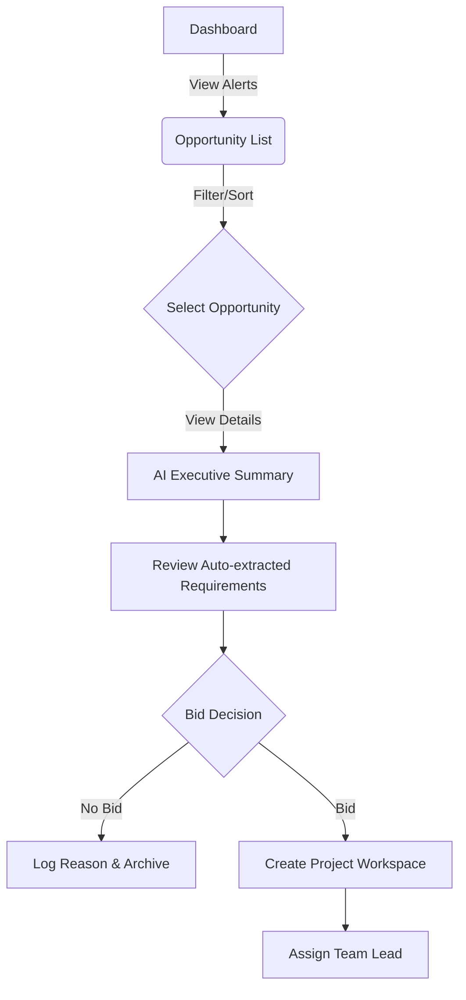
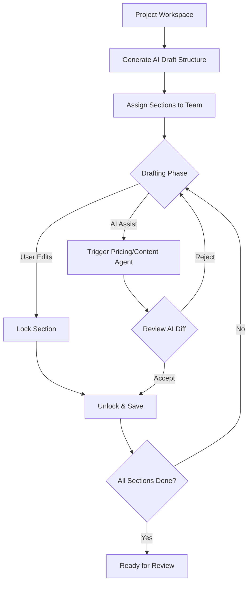
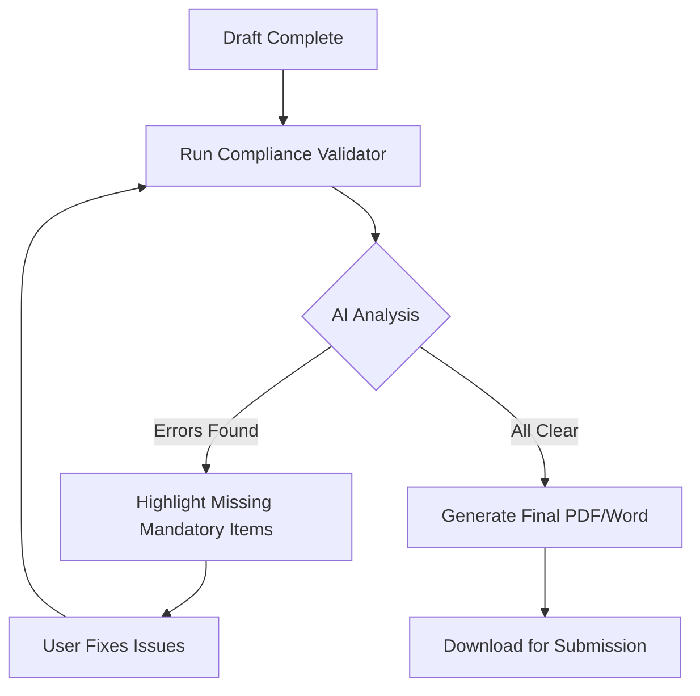

# UX Design Specification eusolicit

**Author:** Deb
**Date:** 2026-04-22

---

## Executive Summary

### Project Vision

EU Solicit is an AI-powered SaaS platform that automates the public procurement and EU grant application lifecycle. By leveraging Agentic AI workflows, it centralizes opportunity discovery, document analysis, and proposal generation, empowering businesses to bid more effectively without relying on expensive consultants or fragmented manual processes.

### Target Users

- **Free Explorer:** Evaluates the platform by browsing opportunities with limited metadata visibility.
- **Starter User:** Small firm user focused on national (Bulgarian) tenders under €500K, relying on AI summaries to pre-qualify opportunities.
- **Professional User:** Mid-size firm user engaged in full proposal collaboration, utilizing AI drafts, compliance checks, and team workflows across multiple countries.
- **Enterprise User:** Large consultancy or enterprise managing multi-client bids with white-labeled, unlimited access.
- **Platform Admin:** Internal operator overseeing AI crawlers, tenant configurations, and compliance frameworks.

### Key Design Challenges

- **Managing Information Density:** Distilling complex regulatory texts, multi-language tender packages, and deep AI analyses into scannable, actionable UI elements.
- **Feature Gating & Tiering:** Designing intuitive access controls and upgrade paths across four distinct pricing tiers based on region, industry, and budget constraints.
- **Workflow Orchestration:** Creating clear, step-by-step interfaces for complex multi-agent processes and multi-user collaborative editing (e.g., section locking, approvals).

### Design Opportunities

- **Contextual AI Co-pilot:** Integrating AI directly into the proposal editor to provide real-time scoring, compliance warnings, and pricing suggestions.
- **Predictive Intelligence:** Utilizing the dashboard as a proactive pipeline forecasting tool rather than just a reactive search interface.
- **Unified Workspace:** Replacing traditional email/spreadsheet bid management with a cohesive environment for tasks, documents, and team communication.

## Core User Experience

### Defining Experience

The core experience of EU Solicit revolves around transforming the overwhelming complexity of public procurement into a structured, guided, and highly actionable workflow. The most critical user interaction is the transition from discovering a massive tender package to reviewing a synthesized compliance checklist and generating a competitive first-draft proposal. The platform's value is realized when users can execute this lifecycle with minimal manual data entry and high confidence in their compliance.

### Platform Strategy

EU Solicit is a web-based SaaS platform designed primarily for desktop use, given the heavy document editing, complex data tables, and multi-user collaboration required for bid preparation. The interface will leverage a robust component system (shadcn/ui) to ensure consistency, fast load times, and a highly responsive, app-like feel for intensive tasks like rich-text editing (Tiptap) and realtime collaboration.

### Effortless Interactions

- **Automated Ingestion:** Uploading 200+ page tender PDFs or ZIP files and having the system instantly extract deadlines, budgets, and compliance requirements without manual data entry.
- **Proactive Risk Flagging:** The system automatically highlights high-risk clauses (e.g., unlimited liability, IP assignment) before the user even begins drafting.
- **Seamless Syncing:** Automatic two-way calendar syncing for deadlines and milestones (Google/Outlook), eliminating manual scheduling.

### Critical Success Moments

- **The "Aha!" Moment:** When the user uploads a complex tender and receives an accurate, one-page executive summary and a fully populated compliance checklist within seconds.
- **The Confidence Builder:** When the Scoring Simulator predicts the proposal's score and provides specific, actionable suggestions to increase the win probability.
- **The Make-or-Break:** The proposal editor must feel as fluid and reliable as Google Docs; collaborative section-locking and threaded comments must work flawlessly to prevent users from reverting to offline Word documents.

### Experience Principles

1. **Clarity Over Density:** Distill massive regulatory frameworks and complex AI analyses into scannable, actionable insights.
2. **AI as a Co-pilot, Not Autopilot:** Always keep the user in the driver's seat. Provide intelligent recommendations (e.g., pricing, bid/no-bid) but allow easy human overrides and justifications.
3. **Frictionless Collaboration:** Eliminate version control anxiety through clear section-locking, threaded comments, and transparent approval workflows.
4. **Proactive Intelligence:** Anticipate user needs by forecasting pipelines and pushing alerts for critical deadlines or regulatory changes, shifting the user from a reactive to a proactive stance.

## Desired Emotional Response

### Primary Emotional Goals

- **Empowered & Confident:** Users must feel they have an unfair advantage over their competitors. They are no longer intimidated by complex EU regulations or 200-page RFPs.
- **Relieved & Calm:** Replacing the usual stress, chaos, and deadline-panic of bid preparation with a sense of structured, predictable control.

### Emotional Journey Mapping

- **Discovery (Free/Starter):** *Curiosity to Epiphany.* Users start skeptical ("Can AI really read a Bulgarian municipal tender?") and transition to amazement when they see an accurate, instant summary.
- **Preparation (Professional):** *Focused & Collaborative.* During the drafting phase, the emotion shifts from individual stress to team-wide alignment. The tool feels like a quiet, highly competent colleague.
- **Submission (All Paid):** *Certainty.* The anxiety of "Did we miss a mandatory form?" is replaced by absolute confidence provided by the Compliance Validator's green checkmarks.
- **Post-Submission:** *Satisfied & Analytical.* Looking at the ROI Tracker and Pipeline Forecast, users feel they are running a data-driven business, not just throwing darts in the dark.

### Micro-Emotions

- **Confidence vs. Confusion:** Clear, contextual AI explanations (e.g., *why* a clause is risky) build trust, whereas black-box AI scores create skepticism.
- **Accomplishment vs. Frustration:** Checking off items on the auto-generated compliance checklist provides continuous micro-doses of accomplishment.
- **Safety vs. Anxiety:** Seeing the "Section Locked by [Name]" indicator creates a feeling of safety, preventing the anxiety of overwriting a colleague's work.

### Design Implications

- **Empowered & Confident → Transparent AI:** The UI must visually separate the source text from the AI's analysis, always providing citations or links back to the original RFP document so users can verify the AI's claims.
- **Relieved & Calm → Guided Workflows:** Instead of a blank page, the system presents a wizard-like flow or a highly structured dashboard that breaks the mountain of work into sequential, manageable tasks.
- **Safety vs. Anxiety → Clear State Indicators:** System state (saving, syncing, locking, validating) must be highly visible and unambiguous. Toasts and inline validations must confirm destructive or critical actions.

### Emotional Design Principles

1. **Never a Black Box:** If the AI scores a proposal a 75/100, the UI must immediately and clearly explain *why*, down to the specific paragraph and evaluation criterion.
2. **Celebrate the Wins, Cushion the Losses:** Use positive reinforcement when compliance checklists hit 100%. When a bid is lost, gently pivot the user to the Lessons Learned Engine to turn failure into actionable data.
3. **Calm the Noise:** The interface should use plenty of whitespace, muted neutral tones for the structural elements, and reserve high-contrast colors (reds/greens) strictly for critical alerts and compliance status.

## UX Pattern Analysis & Inspiration

### Inspiring Products Analysis

- **Notion:** Excellent at handling complex, deeply nested data while maintaining a clean, minimalist interface. The `/` command for inserting blocks is highly relevant for the Proposal Editor.
- **Linear:** Masterclass in high-density data presentation, keyboard navigation, and extremely fast, optimistic UI updates. Relevant for the Task Board and Opportunity listings.
- **Vercel:** Outstanding dashboard design, progressive disclosure of complex technical settings, and clear status indicators (deployments, builds). Relevant for the AI agent execution states and analytics.
- **TurboTax (or similar guided wizards):** Turning complex regulatory requirements into simple, human-readable questions. Highly relevant for the ESPD Builder.

### Transferable UX Patterns

**Navigation Patterns:**
- **Collapsible Sidebar (Linear):** Maximizes screen real estate for dense data tables and document editing while keeping global navigation accessible.
- **Right-side Inspector Panel (Linear/Notion):** Contextual detail view that doesn't force a page reload, maintaining the user's place in a master list.

**Interaction Patterns:**
- **Slash Commands (Notion):** For quickly inserting reusable content blocks or AI components into the Tiptap proposal editor.
- **Inline Editing & Optimistic UI (Linear):** For changing task statuses or requirement checklist items instantly without opening modals.
- **Guided Wizard Stepper:** For complex compliance forms (like the ESPD), breaking them into manageable, validated chunks.

**Visual Patterns:**
- **Skeleton Loading Match (Vercel):** Skeletons that exactly match the structure of the incoming data, preventing layout shift when AI responses load.
- **Semantic Status Badging:** Using a strict, consistent color code for statuses (Green = Success/Complete, Amber = Warning/Pending, Red = Critical/Overdue) across the entire platform.

### Anti-Patterns to Avoid

- **The "Wall of Text":** Dumping the raw output of an LLM onto the screen without structure. AI outputs must be chunked, bulleted, or presented in tables.
- **Hidden Dependencies:** Task boards where blocked tasks aren't visually distinct, leading to confusion about why a task can't be completed.
- **Mystery Meat Navigation:** Overusing icons without text labels, especially for complex domain-specific actions (like "Run Compliance Check").
- **Modal Overload:** Stacking modals on top of modals for editing. Prefer side panels (inspectors) or inline editing.

### Design Inspiration Strategy

**What to Adopt:**
- **Linear's Information Density:** High-density data tables with robust filtering, sorting, and inline actions for the Opportunities and Requirements views.
- **Notion's Editor Experience:** A clean, distraction-free Tiptap editor with slash commands and inline commenting for proposal generation.

**What to Adapt:**
- **Vercel's Build Status → AI Execution Status:** Adapt deployment status indicators to show the real-time progress of multi-agent KraftData workflows (e.g., "Analyzing 3 of 12 documents...").
- **TurboTax's Wizard → ESPD Builder:** Adapt the guided question flow to map company profile data to the European Single Procurement Document schema, highlighting auto-filled vs. manual fields.

**What to Avoid:**
- **Generic "Chat" Interfaces:** Avoid the standard ChatGPT-style chat window. All AI interactions should be contextual, button-driven, or inline within the editor (e.g., a "Pricing Assistant" side panel, not a chat bot asking for prices).

## Design System Foundation

### 1.1 Design System Choice

EU Solicit utilizes a **Themeable Component System** approach, specifically leveraging **shadcn/ui** (built on Radix UI primitives) and styled via **Tailwind CSS**.

### Rationale for Selection

- **Component Ownership & Extensibility:** Components are installed directly into the project source code (`src/components/ui`), not as black-box NPM dependencies. This allows for deep customization and the creation of highly specialized variants (e.g., custom `MetricCard` or `OpportunityCard` types) without fighting library constraints.
- **Accessibility Built-in:** The underlying Radix primitives guarantee WCAG 2.1 AA compliance for complex interactive elements (focus management, keyboard navigation, screen reader support), which is critical for a platform dealing with government procurement.
- **White-Label Architecture:** The styling architecture relies entirely on CSS custom properties (tokens) combined with Tailwind utility classes. This allows the entire platform to be re-themed for Enterprise clients simply by overriding root CSS variables, without requiring CSS recompilation.
- **High-Density Data Support:** The visual aesthetic heavily favors the "Linear/Vercel" paradigm—flat design, generous whitespace around dense data, restrained monochromatic palettes, and typography-driven hierarchy. This ensures the interface chrome does not compete with the complex regulatory data it houses.

### Implementation Approach

- **Core Primitives:** Base interactive components (Dialogs, Sheets, Tabs, Dropdowns) are generated via the shadcn CLI and maintained as project source.
- **Data Presentation:** Headless UI libraries are utilized for complex data tasks, specifically `@tanstack/react-table` for highly interactive, sortable, and filterable data tables, and `Recharts` for analytics visualizations.
- **Layout Architecture:** The application uses a consistent Shell featuring a collapsible left navigation sidebar, a sticky top bar (with global Cmd+K search), and an optional right-side Inspector Panel (Sheet) for progressive disclosure of details.

### Customization Strategy

- **Design Tokens:** All colors, spacing, typography, and elevation values are defined as `--token` variables in a global stylesheet. Dark mode is supported natively via a `.dark` class overriding these tokens.
- **Responsive Scaling:** Following a mobile-first Tailwind approach, complex desktop patterns gracefully degrade (e.g., Data Tables transform into Card Lists below 768px, and Right Inspector Panels convert to Bottom Sheets).

### 2.1 Defining Experience

The defining experience of EU Solicit is **The Orchestrated Proposal Build**. It is the seamless transition from analyzing a massive, complex tender package to collaboratively drafting a compliant response. If users feel that generating a proposal is a guided, safe, and intelligent process rather than a chaotic scramble of Word documents and Excel matrices, the platform succeeds.

### 2.2 User Mental Model

- **Current Paradigm:** Users operate in a state of "version control terror." They use multiple disconnected tools (PDF readers, Excel for compliance checklists, Word for drafting, Outlook for reviews). The mental model is highly fragmented and reactive.
- **New Paradigm:** The "Unified Split-Pane Co-Pilot." Users see the platform as a single, cohesive workspace. The AI is not a generic chatbot; it is a suite of specialized assistants (Pricing, Compliance, Risk) that live in the margins, providing context exactly where and when it is needed, while the user retains full authorial control in the center.

### 2.3 Success Criteria

- **The "Magic" Draft:** Generating a structured first draft—pre-populated with company boilerplate and mapped to the tender's specific requirements—must happen in under 30 seconds and save hours of formatting.
- **Zero Version Anxiety:** Collaborative features (section locking, presence indicators, threaded comments) must be flawless. Users must never fear overwriting a colleague's work.
- **Instant Confidence:** The Compliance Validator must provide immediate, binary feedback (Red/Green) on mandatory requirements, shifting the user's emotion from anxiety to certainty.

### 2.4 Novel UX Patterns

- **Contextual AI Panels:** Instead of a floating "Chat with AI" widget, the system uses highly specific, right-docked Inspector Panels (e.g., the Pricing Assistant Panel) that parse the editor's current context and allow for one-click insertion of complex data structures (like tables or formatted clauses).
- **The AI "Diff" View:** When the AI suggests changes to user-written text or updates a requirement checklist based on new documents, the UI must always present a visual "diff" (additions in green, removals in red) allowing the user to Accept or Reject, rather than silently overwriting data.

### 2.5 Experience Mechanics

1. **Initiation:** The user clicks "Start Proposal" from an Opportunity Detail page. The system prompts them to select a template or allow the AI to generate a structure based on the parsed tender documents.
2. **Interaction:** The user enters the Proposal Editor. The left sidebar shows the document structure and completion status. The center is the Tiptap rich-text editor. The right side houses contextual tools (Insert Content Block, Pricing Assistant).
3. **Feedback:** As the user writes, they can trigger the "Compliance Check." The AI analyzes the section against the linked requirement and provides a localized score (e.g., 85%) with specific improvement suggestions inline.
4. **Completion:** The user completes all sections. The Approval Pipeline stepper at the top of the screen turns green. The user clicks "Export," and the system generates a perfectly formatted, compliant PDF or Word document ready for submission.

## Visual Design Foundation

### Color System

The color system is designed to recede, allowing complex procurement data to take center stage.
- **Neutral Scale:** Tailwind `slate` (slate-50 to slate-900). Used for all backgrounds, borders, and primary/secondary text.
- **Primary Accent:** Indigo (`#4f46e5`). Used sparingly for primary buttons, active states, and focus rings.
- **Semantic Colors:** Reserved strictly for status communication. Success/Awarded (Green), Warning/Closing Soon (Amber), Error/Critical Risk (Red), Informational (Blue).
- **Data Source Colors:** Specific colors map to data sources (AOP = Blue, TED = Green, EU Grants = Purple) for instant visual recognition.

### Typography System

- **Primary Font:** `Inter` (with system sans-serif fallbacks). Chosen for its high legibility in data-dense environments and excellent rendering of tabular numbers.
- **Hierarchy:** Typography relies on subtle shifts in weight (Regular 400 to Bold 700) and color (slate-900 for primary, slate-600 for secondary, slate-400 for tertiary/placeholders) rather than massive jumps in font size.
- **Body Text:** Base size is 16px/1rem (`--text-base`) for optimal readability during long proposal drafting sessions. Minimum size is 12px (`--text-xs`) for non-critical metadata.

### Spacing & Layout Foundation

- **Base Unit:** A strict 4px spacing scale ensures rhythmic consistency across all components.
- **Information Density:** The layout is optimized for "breathable density." Tables are compact to show maximum rows, but card internal padding uses generous 16px–24px gaps to separate distinct data clusters.
- **Application Shell:** A three-pane layout: a collapsible left navigation sidebar (256px -> 64px), a fluid center content area, and a contextual right Inspector Panel (380px) that slides in to reveal details without losing context of the master list.

### Accessibility Considerations

- **Contrast Ratios:** Adherence to WCAG 2.1 AA. Normal text maintains a minimum 4.5:1 contrast ratio; UI components (borders, focus rings) maintain 3:1.
- **Color Independence:** Color is never the sole communicator of state. Status badges always include a text label, and risk severities utilize distinct icons (e.g., octagon for Critical, triangle for High).
- **Reduced Motion:** The system respects `prefers-reduced-motion`. When active, CSS transition durations drop to 0ms, and loading shimmers revert to static placeholders.
- **Keyboard Navigation:** Explicit, highly visible focus rings (2px solid primary, 2px offset) that only appear on `:focus-visible` (keyboard use), not on mouse click.

## User Journey Flows

### Opportunity Discovery & Bid Decision

The journey of finding a relevant tender, analyzing its requirements, and deciding whether to invest resources in bidding.

### The Orchestrated Proposal Build

The core experience of collaboratively drafting the proposal with AI assistance.

### Compliance Validation

The pre-submission journey to ensure zero administrative errors.

### Journey Patterns

- **The "Diff" Pattern:** Whenever an AI agent suggests text or modifies a requirement, the system uses a Git-style diff view, requiring explicit human approval before persisting changes to the central document.
- **Progressive Disclosure:** Complex tender documents are initially presented as high-level summaries. Users drill down into specific clauses only when reviewing specific AI risk flags or writing targeted sections.
- **Contextual Actions:** Actions like "Check Compliance" or "Generate Pricing" are contextual to the section being edited, rather than global actions that disrupt the user's focus.

### Flow Optimization Principles

- **Minimize Dead Ends:** If a bid decision is "No Go," the system immediately prompts the user to log the reason to train the discovery algorithm, turning a dead end into a data-gathering opportunity.
- **Reduce Cognitive Load:** The split-pane editor keeps the source requirement constantly visible while drafting, eliminating the need to tab-switch between PDF readers and Word.
- **Clear State Visibility:** Section locking and sync states are always visible, preventing duplicate work and version control anxiety.

## Component Strategy

### Design System Components

The project utilizes **shadcn/ui**, which provides a robust set of accessible foundation components out of the box:
- **Forms & Inputs:** Buttons, Textareas, Selects, Checkboxes, Switches.
- **Navigation:** Command Menus (Cmd+K), Dropdown Menus, Tabs.
- **Data Presentation:** Data Tables (`@tanstack/react-table` integration), Cards, Badges, Progress Indicators.
- **Overlays:** Dialogs, Sheets (used for Inspector Panels), Toasts/Sonner (for notifications).

### Custom Components

**1. Split-Pane Proposal Editor**
- **Purpose:** Provide a calm, distraction-free writing environment that simultaneously displays complex source requirements.
- **Usage:** Central interaction point for the "Orchestrated Proposal Build" journey.
- **Anatomy:** 
  - Left Sidebar: Document structure outline and completion status indicators.
  - Center: Main Tiptap rich-text editing canvas.
  - Right Sidebar: Sliding context panel (e.g., AI assistants, requirement details).
- **States:** Default (editing), Loading (AI generating), Locked (being edited by a colleague).
- **Accessibility:** Ensure focus management between panes; clear ARIA announcements when AI panels open/close.

**2. AI Diff Review Block**
- **Purpose:** Safely present AI-generated content suggestions or requirement changes for human review.
- **Usage:** Inline within the editor when an agent returns data, or within a modal when reviewing broad compliance updates.
- **Anatomy:** Side-by-side or inline text view showing deletions in red strike-through and additions in green highlight, paired with sticky "Accept" and "Reject" buttons.
- **Interaction Behavior:** Never persists data to the backend until explicit human approval is given. Keyboard shortcuts (e.g., `Cmd+Enter` to accept) should be supported.

**3. Compliance Metric Card**
- **Purpose:** Instantly communicate the health and readiness of a proposal section.
- **Usage:** Displayed at the top of the proposal editor and on the main project dashboard.
- **Anatomy:** A prominent circular progress ring (e.g., 85%), a fraction (e.g., 17/20 requirements met), and an expandable accordion detailing missing mandatory items.
- **States:** Green (100% compliant), Amber (Missing non-mandatory/Warnings), Red (Missing mandatory).

### Component Implementation Strategy

- **Foundation First:** Install and configure all required shadcn/ui components (`button`, `dialog`, `sheet`, `table`, etc.) into `src/components/ui`, applying our defined Tailwind tokens (slate/indigo).
- **Headless Composition:** For the Custom Components, prioritize headless primitives. The Split-Pane Editor will heavily rely on Tiptap's headless architecture, styled with standard Tailwind typography classes.
- **Atomic Design:** Build from the smallest units up. Ensure standard forms and badges are styled perfectly before assembling the complex Dashboard Data Tables or the AI Diff Review Block.

### Implementation Roadmap

**Phase 1 - Core Workspace:**
- Base shadcn/ui library installation and token configuration.
- Standard Layout Shell (Sidebar, Top Nav, Sheet Inspector).
- Basic Tiptap integration for the Proposal Editor.

**Phase 2 - Data & Intelligence:**
- High-density Data Tables for Opportunity Discovery.
- The AI Diff Review Block and Compliance Metric Card.
- Contextual Command Menus (Cmd+K).

**Phase 3 - Collaboration & Polish:**
- Visual state indicators for Section Locking and real-time presence.
- Advanced Tiptap extensions (inline comments, slash commands).
- Final accessibility audits and focus state polishing.

## UX Consistency Patterns

### Button Hierarchy & Actions

- **Primary Actions:** Solid Indigo (`bg-indigo-600`). Used for the single most important action on a screen (e.g., "Create Proposal", "Export PDF"). Never use more than one Primary button per view.
- **Secondary Actions:** Outline or Ghost styles (`border-slate-200`). Used for alternative actions like "Cancel", "Save Draft", or "Preview".
- **Destructive Actions:** Solid Red (`bg-red-600`). Used strictly for actions that permanently delete data or withdraw a bid. Always paired with a confirmation dialog.
- **Icon Buttons:** Used in dense tables and toolbars. Must always include a tooltip for accessibility and clarity.

### Feedback Patterns

- **Transient Success:** Bottom-right Toasts (via Sonner). Used for non-blocking confirmations like "Draft Saved" or "User Invited". Disappear after 3 seconds.
- **Persistent Warnings:** Inline Alert banners (Amber/Red). Used for critical states that require user resolution before proceeding, such as "Compliance Error: Missing ESPD Form". These cannot be dismissed until the issue is fixed.
- **Loading States:** No generic spinning wheels for main content. We use Skeleton loaders that exactly mimic the shape of the incoming data (e.g., a 5-row table skeleton) to prevent Cumulative Layout Shift (CLS) and reduce perceived wait time during AI generation.

### Form Patterns

- **Structure:** Top-aligned labels for faster scanning. One column layout for primary forms; multi-column only used for dense, related data (like an address block).
- **Validation:** Real-time inline validation (via Zod). Error messages appear immediately below the field in Red (`text-red-500`) upon `onBlur` (losing focus), not while the user is actively typing.
- **Progressive Disclosure:** Complex forms (like the ESPD builder) are broken into Wizard Steppers to prevent cognitive overload, rather than presenting a 50-field vertical scroll.

### Navigation Patterns

- **Global Navigation:** Collapsible left sidebar containing primary modules (Dashboard, Opportunities, Proposals, Settings).
- **Contextual Navigation:** Breadcrumbs (`Dashboard > Sofia Municipality > Proposal Draft`) are always present at the top left of the workspace to prevent users from getting lost in deeply nested tender documents.
- **Progress Navigation:** Horizontal Steppers used within the Proposal Builder to indicate macro-phases (Setup -> Drafting -> Compliance -> Export).

### AI Interaction Patterns

- **The "Diff" Pattern:** Any time an AI agent modifies existing user text or alters a compliance checklist, the UI must present a Git-style visual diff (Red for removals, Green for additions). The system never silently overwrites user data.
- **Explainability Tooltips:** AI-generated scores (e.g., a "Match Score of 85%") must have an info icon or popover that explicitly details *why* the score was given, citing specific clauses from the source document.

## Responsive Design & Accessibility

### Responsive Strategy

EU Solicit adopts a **Desktop-First** responsive strategy, acknowledging the inherent complexity and screen real estate requirements of heavy document authoring and data table analysis.

- **Desktop (1024px+):** The primary environment. Utilizes the full 3-pane layout (Navigation, Main Canvas, Contextual Inspector). Optimized for high-density data and complex workflows.
- **Tablet (768px - 1023px):** The "Review Environment." Layouts gracefully degrade: the inspector panel converts to an overlapping drawer, and data tables hide non-critical columns. Ideal for reviewing drafts or checking dashboards on the go.
- **Mobile (< 767px):** The "Triage Environment." A radically simplified interface focused entirely on notifications, quick metric checks, and workflow approvals. Complex authoring features are explicitly disabled to prevent a degraded user experience.

### Breakpoint Strategy

We will utilize standard Tailwind CSS breakpoints, customized slightly for our density needs:
- `sm` (640px): Shifts from mobile triage view to tablet review view.
- `md` (768px): Introduces multi-column layouts for dashboards.
- `lg` (1024px): Standard desktop. Enables persistent sidebars.
- `xl` (1280px): Enables the full 3-pane split-editor view.
- `2xl` (1536px): Max width constraint applied to prevent extreme line-lengths in the proposal editor.

### Accessibility Strategy

EU Solicit strictly adheres to **WCAG 2.1 AA** compliance, as is standard and often legally required for platforms intersecting with government procurement.

- **Color Contrast:** Strict minimum of 4.5:1 for standard text and 3:1 for large text and active UI component boundaries.
- **Keyboard Navigation:** The platform must be fully operable without a mouse. This includes focus trapping within modals/sheets and logical tab-indexing through complex data tables.
- **Screen Reader Support:** Deep integration of ARIA labels, especially for dynamically updating AI elements (e.g., announcing when an AI analysis is complete) and complex table structures.

### Testing Strategy

- **Automated:** Integration of `axe-core` into the CI/CD pipeline to catch fundamental structural issues (missing alt tags, poor contrast) on every pull request.
- **Manual Keyboard Audits:** Mandatory testing phase for every new component to ensure seamless keyboard traversal and visible focus states.
- **Screen Reader Verification:** Periodic manual audits using VoiceOver (macOS) and NVDA (Windows) specifically targeting the Proposal Editor and AI Diff views.

### Implementation Guidelines

- **Semantic HTML:** Rely on native HTML5 elements (`<nav>`, `<main>`, `<article>`) before applying ARIA roles.
- **Focus Management:** When opening the right-hand Inspector panel, focus must immediately shift to the panel. When closing, focus must return to the element that triggered it.
- **Reduced Motion:** Respect the user's OS-level `prefers-reduced-motion` settings. When enabled, disable sliding sheet animations and transition instantly.

<!-- UX design content will be appended sequentially through collaborative workflow steps -->